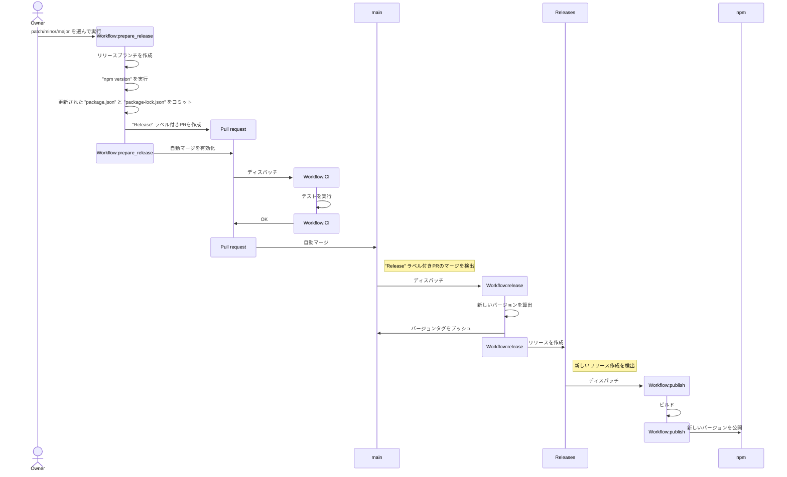

## :twisted_rightwards_arrows: Branch naming conventions

```
{github username}/{base branch}/{topic name}
```

e.g. `844196/main/some-topic`

## :speech_balloon: Commit message conventions

See [gitmoji](https://gitmoji.dev/).

## :hammer: Development scripts

Requirements [go-task/task](https://taskfile.dev/).

### Lint

```sh
task lint
```

or

```sh
task lint:prettier
task lint:tsc
task lint:eslint
```

### Testing

```sh
task test
```

### Build

```sh
task build
```

## :rocket: Release workflow


